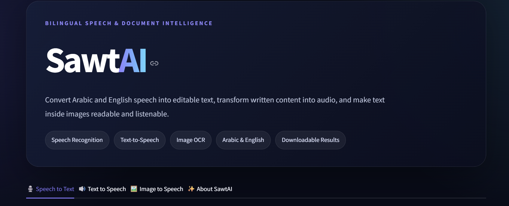
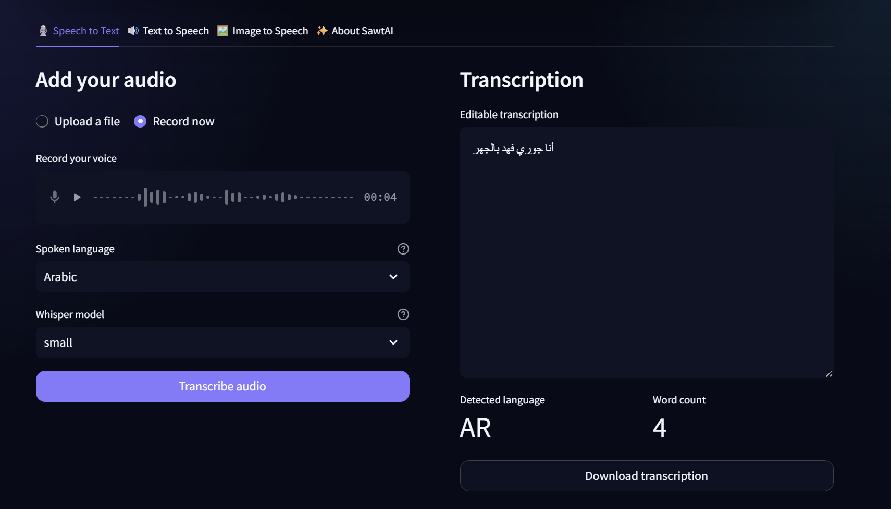
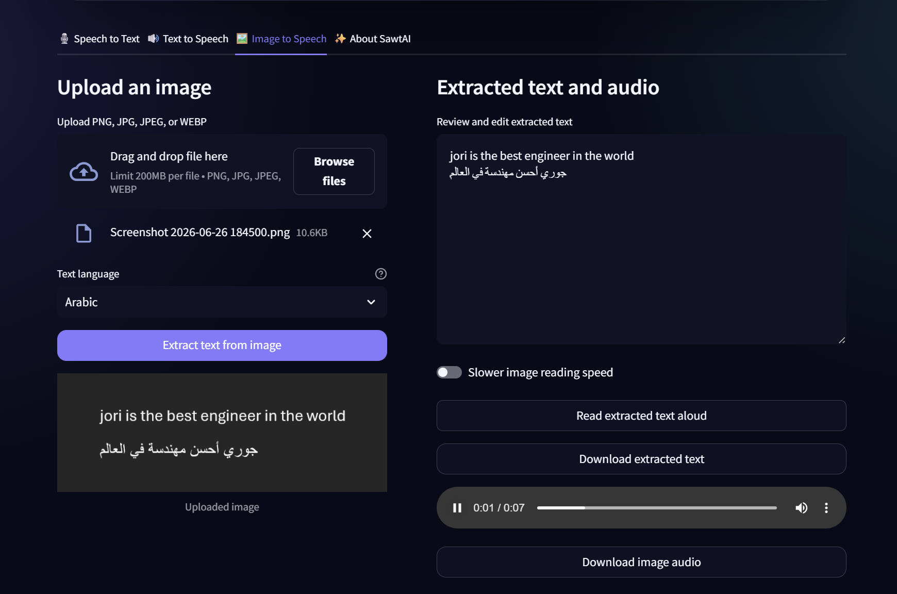

# SawtAI — Arabic & English Content Converter

SawtAI is a bilingual web application that converts Arabic and English content between speech, text, images, and audio through a simple Streamlit interface.

## Interface

## Features

### Speech to Text

Upload or record Arabic and English audio, convert it into editable text using OpenAI Whisper, and download the transcription.

### Text to Speech

Convert Arabic or English text into audio, choose the speaking speed, listen to the result, and download it as an MP3 file.

[Watch the Text to Speech demo](txt.mp4)

### Image to Speech

Extract Arabic and English text from images using EasyOCR, review or edit the result, and convert the extracted text into speech.

## Supported Files

**Audio:** WAV, MP3, M4A, MP4, MPEG, MPGA  
**Images:** PNG, JPG, JPEG, WEBP

## Use Cases

- Transcribing Arabic and English recordings.
- Converting written content into audio.
- Extracting text from screenshots and scanned images.
- Supporting users who prefer listening to written content.

